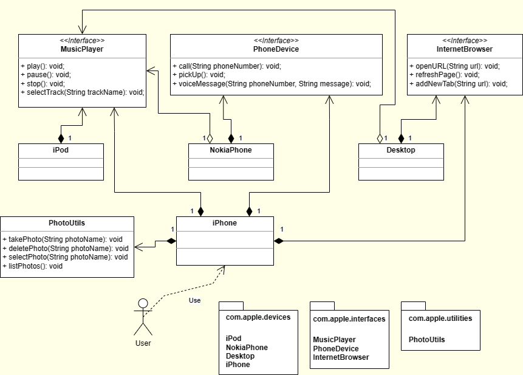

# iPhone 2007 - Projeto POO

Desafio de projeto de POO (Programação Orientada a Objetos) da DIO.me proposta pelo professor [Gleyson Sampaio](https://github.com/glysns). Abaixo a descrição do desafio:

```
Modelagem e diagramação da representação em UML e Código no que se refere ao componente iPhone.

Com base no vídeo de lançamento do iPhone conforme link abaixo, elabore em uma ferramenta de UML de sua preferência a diagramação das classes e interfaces com a proposta de representar os papéis do iPhone de: Reprodutor Musicial, Aparelho Telefônico e Navegador na Internet. Em seguida crie as classes e interfaces no formato de arquivos .java

Comportamentos esperados:

- Repodutor Musicial: tocar, pausar, selecionarMusica
- Aparelho Telefônico: ligar, atender, iniciarCorrerioVoz
- Navegador na Internet: exibirPagina, adicionarNovaAba, atualizarPagina
```

## Diagrama UML


